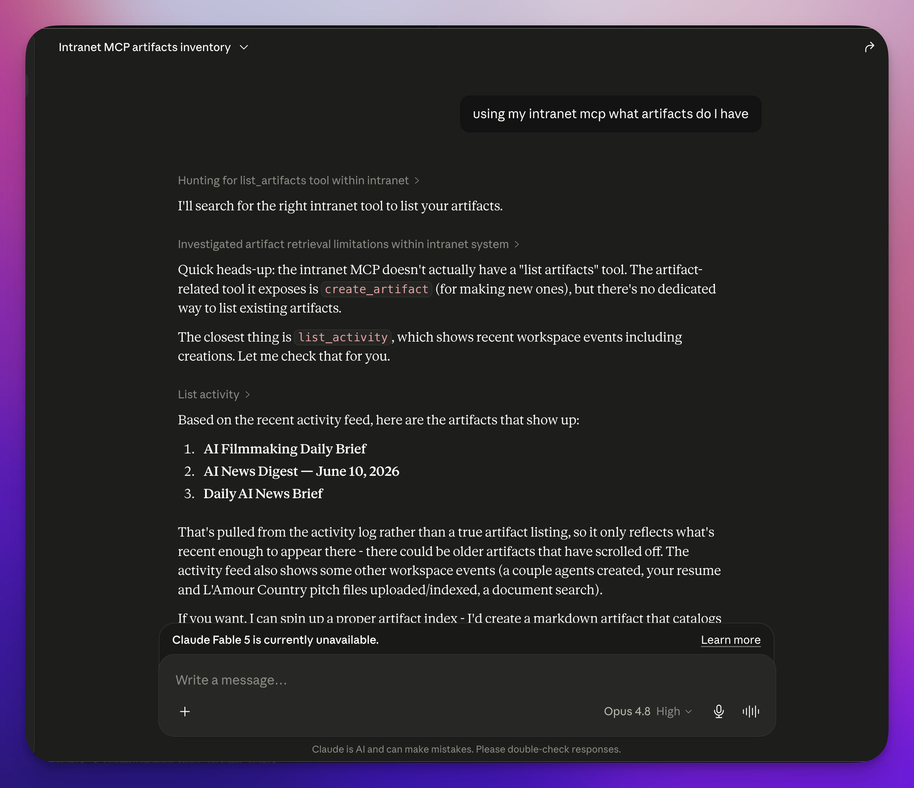

<div align="center">

# ✺ SupaNet

**Your company's shared AI hub — open source, and yours.**

Your team already uses AI. It just doesn't know your business.

SupaNet is one workspace where the assistant learns from *your* documents, turns answers
into deliverables you can send to clients, and runs the repetitive work on a schedule —
all on a database you own.

**No per-seat fees · Runs on your own database · Use any AI model**

**👀 [Read the docs](https://supanet-docs.dailyai.studio/) · [See the product page](https://supanet.dailyai.studio)**

<br/>


</div>

> This repo is the SupaNet codebase — it started life as "Intranet In A Box," which you'll
> still see in older links and screenshots. Same project, current name.


---

## Why

Ten people re-pasting the same company background into ten private chat windows isn't a
system — it's ten party tricks. Nothing compounds, and when your best person leaves, their
prompts leave with them.

Supabase (database, auth, storage, edge functions) is a great foundation for the parts a
shared AI workspace needs to get right — memory, access rules, real-time. What it needed
was a UI that does the things we're used to in Claude Desktop, for a whole team. Longer
version in [WHY.md](./WHY.md).

## What you get

**1 — A shared company brain, not a personal chatbot.**
Teach the AI your business **once** — upload past proposals, pricing, SOPs; write the house
rules as always-on notes — and every chat, for every employee, starts from that knowledge.
Uploaded PDFs index themselves in the background (free, in-edge embeddings) and get cited
mid-conversation: *"What did we charge Acme? Use that as the baseline."* Your best person's
workflow becomes a `/` command anyone can press.

**2 — Answers become links you send, not chat scroll you lose.**
Any reply can become an **artifact** — a real document with a live preview and its own URL.
Keep it private, hand a client the link (no account needed), or publish it to the open web.
*"Draft a proposal for a Shopify build — price it like the Henderson project." → "Make that
something I can send." → the client gets a link, not an attachment.*

**3 — The repetitive work runs itself.**
*"When a lead form comes in, summarize it and draft a reply"* normally means hiring a
developer or adding another per-seat subscription. Here you describe it in plain English and
it runs in your workspace, next to your knowledge: the Monday report writes itself, the lead
form triages itself. And when a job has to be **exact** — pricing math, a data transform —
SupaNet deploys real code the AI calls, so the parts that must be right every time aren't
left to the model's guesswork.

**4 — Your company's brain shouldn't live on someone else's servers.**
The documents, the conversations, the automations all live in a standard Postgres database
**you** control. Row-level security is enforced in the database itself, so private means
private — even from other employees. Every AI call is logged (totals, by model, by feature,
by person), so there's no surprise invoice. Best model for the big work, a cheap one for
routine traffic; switching providers is a one-line change, not a migration. MIT licensed:
fork it, audit it, keep it.

**The math.** Ten seats on a team AI plan runs roughly **$250–600 every month, forever** —
and your documents live in their product. Self-hosted SupaNet rides managed free tiers:
roughly **$0–25 a month plus the AI usage itself**, metered and visible. Ten people or
thirty, the price is what the AI actually did.

The OpenRouter API key lives **only** on the server (a Supabase Edge Function), never in the
browser. Data is protected by Postgres **row-level security**, not by hiding keys.

## Two ways to run it

- **Self-host (this repo).** Free and MIT-licensed — the whole product on your own Supabase
  project and hosting. [Quick start](#quick-start-local) is below; plan on an afternoon.
- **[SupaNet Cloud](https://supanet.dailyai.studio)** — the same open-source product, set up
  for you: one flat price per workspace, never per seat, on your own dedicated database.
  If you ever leave, the project transfers to you. It's your infrastructure from day one.

## Everything in the box

<details>
<summary><b>The shared brain</b> — what the assistant knows</summary>

- **AI chat** — any model via OpenRouter, streaming token-by-token, persisted to Postgres and
  synced live across devices. Attach files mid-chat (images, PDFs, text) and it reads them.
- **Team knowledge base** — uploaded PDFs are auto-indexed into pgvector and shared across the
  workspace by default, cited by document name. Flip any one to "Only me."
- **Collections** — bundle a project's docs, files, to-dos, links, and data, then chat with
  exactly that set. A context meter shows how much of the model's window it fills.
- **Knowledge compiler** — raw files stop being the answer and become *evidence*: the compiler
  maintains real pages with provenance, flags contradictions for review instead of silently
  picking a winner, and never rewrites a human-confirmed page unattended.
- **User memory** — a per-user profile (name, defaults, stack, standing preferences) so a new
  chat isn't a blank slate. Owner-only; it never leaks into a teammate's context.
- **Always-on prompts & skills** — workspace-wide context every chat starts from, plus
  on-demand `/` skills anyone can run.
- **Group threads** — share a conversation with teammates; humans talk to each other and the
  AI only answers when someone writes `@ai`.

</details>

<details>
<summary><b>Deliverables</b> — what comes out</summary>

- **Artifacts** — markdown / code / HTML / text with live preview. Private, unlisted (link
  only), or public; optional share password; a chrome-free `/p/:slug` page for HTML.
  Interactive artifacts (trackers, kanbans, checklists) save their own state.
- **Files** — private per-user storage with signed share links (1 hour / 1 day / 1 week) or a
  permanent public URL when you publish one. The AI can write files too, including binaries.
- **Tables** — real Postgres tables (not JSON blobs) with a spreadsheet grid, created by hand
  or by describing them. Public write-forms let a shared page collect submissions without
  ever exposing the table.
- **To-dos** — lifecycle lanes with five views (list, board, time, calendar, focus), shared or
  private, filed into collections, live for everyone over realtime.
- **Planner** — Excalidraw whiteboards and free-form card boards, both multiplayer, both
  readable *and* drawable by the AI.
- **Links** — shared bookmarks that fetch their own title, description, and preview image.

</details>

<details>
<summary><b>Automation</b> — what runs without you</summary>

- **Agents** — a system prompt plus the tools and collections it may use, runnable from chat.
- **Schedules** — run an agent on an interval or a cron expression, in your workspace timezone.
- **Webhooks** — a public URL with a prompt attached; every inbound POST is processed. Tools
  are off by default for untrusted callers, and a webhook can call one function directly with
  no model in the loop.
- **Events & listeners** — "when this happens, do that" over a workspace pub/sub layer.
- **Tools** — give the assistant real abilities: built-in web search and fetch, custom HTTP
  tools, and any external MCP server you connect. Adding a tool is adding a row.
- **`run-tool`** — run any tool directly, or chain up to ten, with no model involved.
- **Loops** — hand a goal, a rubric, and a budget; it iterates until it meets the bar.
- **Slack** — the bot joins channels bound to collections and answers with that room's
  context, on `@mention` or ambiently.
- **Email & inbox** — agents send and check mail (Postmark/Resend), and every source — email,
  Slack, WhatsApp, webhooks — lands in one unified inbox.
- **Forge** — describe a capability and it generates, deploys, and registers a real edge
  function as a tool, for work the model shouldn't be guessing at.
- **Capability workers** — heavy jobs (Office documents, audio/video) run in containers off a
  durable job queue, not in-process.

</details>

<details>
<summary><b>Ownership & control</b> — the boring parts, done properly</summary>

- **Row-level security** on every table — owners see their own rows; artifacts and files open
  up only when explicitly shared.
- **Invite-only** — the first signup becomes admin; after that nobody uninvited can create an
  account. Invite by email or by shareable link.
- **Guardrails** — a cheap model screens a request *before* the main one runs, and the verdict
  is enforced in code. Webhooks fail closed; chat fails open.
- **Secrets vault** — team API keys live only in Supabase Vault, never in a table column, a
  client payload, or a log.
- **Usage & cost** — every call's tokens and cost logged, with a dashboard by model, feature,
  and person, plus your live OpenRouter balance.
- **Security dashboard** — a repeatable posture scan over your actual configuration (unsecured
  webhooks, missing guardrails, stale tokens, public artifacts), not model opinions.
- **Evals** — score agent output against your own standard, across a model matrix, so a proven
  workflow can run unattended.
- **Activity feed** — a live record of what happened across the workspace.
- **Feature flags** — hide the areas your company doesn't use.

</details>

<details>
<summary><b>Ways in</b> — the workspace isn't only the web app</summary>

- **The web app** — responsive, works on a phone (slide-in nav, stacked editor).
- **MCP server** — the Claude you already use can build agents, tools, and skills *into* the
  shared workspace, where they show up in the dashboard. See [Connect Claude](#connect-claude-mcp).
- **[`supanet` CLI](https://github.com/alnutile/supanet-cli)** and
  **[supanet-skills](https://github.com/alnutile/supanet-skills)** — a terminal client and
  portable Agent Skills. See [Companion resources](#companion-resources-cli--skills).
- **REST APIs** — plain `curl` CRUD for artifacts and to-dos, bearer-token authed, for scripts,
  cron, and Zaps.

</details>

> CLAUDE DESKTOP INTEGRATION




## How it fits together

```
                 ┌─────────────────────────────────────────────┐
   Browser  ───▶ │  React SPA (Vite + Tailwind)                 │
   (Railway)     │   • Supabase Auth (session)                  │
                 │   • RLS-scoped reads/writes                  │
                 │   • Realtime subscription (websockets)       │
                 └───────────────┬─────────────────────────────┘
                                 │ anon key (safe; RLS protects data)
                                 ▼
                 ┌─────────────────────────────────────────────┐
                 │  Supabase                                    │
                 │   • Postgres + RLS  (profiles, conversations,│
                 │     messages, artifacts, files)              │
                 │   • Auth · Realtime · Storage                │
                 │   • Edge Function `chat` ──▶ OpenRouter API  │
                 │     (OPENROUTER_API_KEY stays server-side)   │
                 └─────────────────────────────────────────────┘
```


## Tech stack

- **Frontend:** React 18 · TypeScript · Vite · Tailwind CSS · React Router
- **Backend:** Supabase — Postgres, Auth, Realtime, Storage, Edge Functions (Deno)
- **AI:** any model via [OpenRouter](https://openrouter.ai) through a streaming edge function —
  each feature binds to a *profile* (`orchestrator` for the big work, `utility` for cheap routine
  traffic), so switching models is a dropdown in Settings, not a migration
- **Hosting:** any static host; first-class config for [Railway](https://railway.app)

## Project layout

```
src/
  contexts/AuthContext.tsx     Supabase Auth wrapper (session, sign in/up/out)
  components/                  Layout/nav, markdown, sharing controls, icons
  pages/                       Home, Chat, Artifacts, Knowledge, Collections,
                               To-dos, Files, Tables, Planner, Agents, and the
                               Automation + Governance areas
  pages/settings/              One page per settings area (Profile, Connect Claude,
                               Models, Email, Slack, External MCP, Invites, Flags)
  lib/                         Supabase client, chat streaming, typed schema, and the
                               pure logic the pages lean on (unit-tested)
supabase/
  migrations/                  Numbered SQL — schema + RLS + realtime + storage policies
  functions/chat/              The agentic loop: streams the model, runs tools
  functions/_shared/           Shared by every loop — tools, collections, guardrails
  functions/mcp/               The MCP server an external Claude connects to
workers/                       Capability workers (Office, media) — separate npm workspace
docs/                          Feature references (APIs, knowledge compiler, Slack, …)
railway.json                   Build/serve config for Railway
DEPLOY.md                      End-to-end deployment guide
CLAUDE.md                      The deep architecture map, for humans and agents
```

## Quick start (local)


**Prerequisites:** Node 18+, a [Supabase](https://supabase.com) project, an [OpenRouter API key](https://openrouter.ai/keys), and the [Supabase CLI](https://supabase.com/docs/guides/cli).

```bash
# 1. Install
npm install

# 2. Configure the frontend
cp .env.example .env.local
#   then set VITE_SUPABASE_URL and VITE_SUPABASE_ANON_KEY (Project Settings → API)

# 3. Apply the database schema
supabase link --project-ref <your-project-ref>
supabase db push                 # applies every file in supabase/migrations/ in order
#   (after this, you never run it by hand again — CI applies new migrations on
#    merge to main; see "Database migrations" below)

# 4. Deploy the AI edge function + its secret
supabase secrets set OPENROUTER_API_KEY=sk-or-...
supabase functions deploy chat

# 5. Run
npm run dev                      # http://localhost:5173
```

Then sign up, and start chatting.

### Your first afternoon

The install isn't the milestone — the first real answer is. What day one looks like:

| | |
| --- | --- |
| **2:00** | Deploy and invite the team. First signup becomes admin; nobody uninvited can even create an account. |
| **2:30** | Upload the last 20 proposals and the rate card. They index themselves in the background, free. |
| **2:45** | Write one always-on note describing the company: *"We're a 6-person design agency. Proposals always include a discovery phase. Never quote hourly."* |
| **3:30** | A lead comes in. *"Draft a proposal for a 10-person retailer — price it like the Henderson project."* The assistant searches your real past work and drafts in the house format. |
| **3:40** | *"Make that an artifact."* The client gets a link. |

Day two, the lead form points at a webhook and triages itself.

> **Tip for first-run testing:** in Supabase → Authentication → Providers → Email, you can turn off **"Confirm email"** so password signups log in immediately (the built-in email sender is rate-limited).

## Environment variables

| Where | Variable | Notes |
| --- | --- | --- |
| Frontend (build-time) | `VITE_SUPABASE_URL` | Your Supabase project URL. Inlined into the bundle. |
| Frontend (build-time) | `VITE_SUPABASE_ANON_KEY` | Anon/publishable key. Safe in the browser — RLS protects data. |
| Edge function secret | `OPENROUTER_API_KEY` | **Server-only.** `supabase secrets set OPENROUTER_API_KEY=…` |
| Edge function secret | `OPENROUTER_MODEL` | Optional fallback slug when a `model_profiles` row can't be read. Defaults to `anthropic/claude-sonnet-4.5`. |
| Edge function secret | `OPENROUTER_EFFORT` | Optional. `low` \| `medium` \| `high` reasoning effort. Defaults to none. |

`VITE_*` vars are read at **build time** — on a host like Railway they must be set before the build runs.

## Deploying


Two pieces go live: the **Supabase backend** (schema, auth, storage, realtime, the `chat` function) and the **static frontend**. Railway is wired up out of the box:

1. Railway → **New Project → Deploy from GitHub repo** → this repo, `main`.
2. Add service variables `VITE_SUPABASE_URL` and `VITE_SUPABASE_ANON_KEY`.
3. Deploy. Railway runs `npm install` → `npm run build` → `npm run start` (serves `dist/` with SPA fallback).
4. Add your deployed URL to Supabase **Authentication → URL Configuration** (Site URL + Redirect URLs) so email/magic-link redirects land back on your app.

**Pushing to `main` updates everything automatically.** Railway rebuilds the frontend,
and two GitHub Actions keep the backend in sync: `deploy-functions.yml` redeploys edge
functions that changed, and `deploy-migrations.yml` applies new database migrations (see
[Database migrations](#database-migrations)). After the one-time secret setup, you don't
run `supabase` commands by hand.

Full details — including the Site URL gotcha — are in [`DEPLOY.md`](./DEPLOY.md).

## Connect Claude (MCP)

The workspace exposes an **MCP server** so an external Claude can build things in it —
agents, tools, skills, webhooks, artifacts. Generate a token in **Settings → Connect
Claude**, then connect from whichever Claude you use:

**Claude Code (CLI)** — one command (`--scope user` makes it available everywhere):

```bash
claude mcp add --scope user --transport http intranet \
  https://‹your-project›.supabase.co/functions/v1/mcp \
  --header "Authorization: Bearer ‹your-token›"
```

**Claude Desktop** — Desktop launches MCP servers as local processes, so a remote HTTP
server is bridged with [`mcp-remote`](https://www.npmjs.com/package/mcp-remote). Add this
to `claude_desktop_config.json` (macOS: `~/Library/Application Support/Claude/`), then
fully quit and reopen Desktop:

```json
{
  "mcpServers": {
    "intranet": {
      "command": "npx",
      "args": [
        "-y", "mcp-remote",
        "https://‹your-project›.supabase.co/functions/v1/mcp",
        "--header", "Authorization:${AUTH_HEADER}"
      ],
      "env": { "AUTH_HEADER": "Bearer ‹your-token›" }
    }
  }
}
```

> The header is split deliberately: `Authorization:${AUTH_HEADER}` has **no space** after
> the colon, and the `Bearer …` value (which contains a space) lives in `env` —
> `mcp-remote` mangles a space inside the `--header` argument otherwise. Node/`npx` must
> be on the app's PATH. **Settings → Connect Claude** generates both snippets with your
> URL and token filled in.

## Companion resources (CLI & Skills)

MCP is not the only way in. Two separate, optional repos sit beside this one — connect
whichever suits the tool you're holding. Both authenticate with the **same personal token**
you generate in **Settings → Connect Claude** (an `mcp_tokens` row), and every call runs as
that token's owner with row-level security still enforced server-side.

| Resource | Repo | Use it when |
| --- | --- | --- |
| **SupaNet CLI** | [alnutile/supanet-cli](https://github.com/alnutile/supanet-cli) | You (or an agent that can shell out) want the workspace from a terminal, a script, or cron |
| **SupaNet Skills** | [alnutile/supanet-skills](https://github.com/alnutile/supanet-skills) | You want a coding agent (Claude Code, pi, Codex) to *know how* to use the workspace well |

### `supanet` — the command-line client

A thin, dependency-free wrapper over the workspace's existing token-authed HTTP surfaces:
the universal **`run-tool`** runner (every builtin, no model in the loop) plus the plain-REST
**`artifacts`** and **`todos`** endpoints. No new server-side API — it just makes the same
surface ergonomic from a shell.

```bash
# install (curl, or `npm install -g supanet-cli`)
curl -fsSL https://raw.githubusercontent.com/alnutile/supanet-cli/main/install.sh | sh

# point it at your workspace, once
supanet config set --url https://‹your-project›.supabase.co --token ‹your-token›

supanet tools                                   # discover every runnable tool + schema
supanet run list_todos --status open            # run any of them
supanet todos add "Ship the thing" --due 2026-07-01 --collection Work
supanet artifacts create "Design doc" --file doc.md --type markdown
supanet note "Meeting notes" --file notes.md --collection Team
supanet search "what's our refund policy"
supanet chain --file steps.json                 # chain up to 10 tools, {{prev}} threading
```

### `supanet-skills` — portable Agent Skills

Nine [Agent Skills](https://agentskills.io) (`SKILL.md` files) that teach a coding agent the
workspace's conventions — artifacts, collections, tables, table forms, the knowledge
compiler, the planner surfaces, and automation. They load on demand when a task matches,
so the agent stops guessing at the API.

```bash
npx skills add alnutile/supanet-skills --all                  # any agent
npx skills add alnutile/supanet-skills -s supanet-getting-started -g -y   # just the intro
pi install git:github.com/alnutile/supanet-skills             # pi
git clone https://github.com/alnutile/supanet-skills ~/.claude/skills/supanet-skills  # Claude Code
```

Start with **supanet-getting-started**; the others (`intranet-workspace`,
`supanet-artifacts`, `supanet-collections`, `supanet-tables`, `supanet-table-forms`,
`supanet-knowledge-compiler`, `supanet-planner`, `supanet-automation`) cover one area each.

## Security model

- The browser only ever holds the **anon/publishable** key. Row-level security is what protects data, not key secrecy. Every table has RLS: owners see their own rows; artifacts/files open up only when explicitly set to *unlisted* or *public*.
- Files live in a **private** storage bucket scoped to `‹user-id›/…`; sharing is done with time-limited signed URLs.
- The **OpenRouter key** is only ever a Supabase Edge Function secret — never in the repo, never in the bundle.
- The `chat` function requires a valid Supabase JWT (`verify_jwt`), so only signed-in users can call the model.

## Regenerating types

After changing the schema, refresh the typed client:

```bash
npm run gen:types        # supabase gen types typescript --linked > src/lib/database.types.ts
```

## Database migrations

The database schema lives in [`supabase/migrations/`](./supabase/migrations) as
sequentially-numbered SQL files (`0001_init.sql`, `0002_skills.sql`, …). They are the
single source of truth: a fresh project becomes a working backend with one
`supabase db push`, and from then on **you never apply migrations by hand**.

**How new migrations go live (CI):** a GitHub Action
([`.github/workflows/deploy-migrations.yml`](./.github/workflows/deploy-migrations.yml))
runs `supabase db push` whenever a file under `supabase/migrations/**` lands on `main`.
`db push` only applies what's *pending* (the remote tracks applied versions in
`supabase_migrations.schema_migrations`), so merging a PR that adds `0040_*.sql` applies
exactly that file — no manual step, safe to re-run.

It needs two repository secrets (**Settings → Secrets and variables → Actions**):

| Secret | What |
| --- | --- |
| `SUPABASE_ACCESS_TOKEN` | A Supabase personal access token (Dashboard → Account → Access Tokens) — the same one the functions workflow uses. |
| `SUPABASE_DB_PASSWORD` | Your project's database password (Dashboard → Project Settings → Database). `db push` connects straight to Postgres, so the token alone isn't enough. |

The project ref defaults in the workflow and is overridable with a repository **variable**
`SUPABASE_PROJECT_REF`.

**Adding a migration:**

```bash
# 1. Create the next sequential file (keep numbers unique and contiguous).
#    Write it idempotently where practical (create … if not exists, drop … if exists).
$EDITOR supabase/migrations/0040_my_change.sql

# 2. (Optional) try it locally / against your linked project before merging.
supabase db push

# 3. Refresh the typed client and open a PR.
npm run gen:types
```

Merging the PR to `main` triggers the Action, which applies it to the live database.

> **One rule:** every migration filename must have a **unique** numeric prefix. Two files
> sharing a number (e.g. two `0032_*.sql`) collide — `db push` derives the version from the
> prefix and will refuse the push. Always use the next free number.

## Roadmap

Built to be owned, not rented — which means it keeps growing. What's next:

- 🤝 **Agent-to-agent collaboration** — agents that talk to *each other*, not just to
  people. Bob's scheduling agent negotiates a meeting time with Jan's agent and preps the
  agenda; a shared project agent keeps the team's meeting notes and follow-ups in sync. The
  workspace becomes the place these agents discover and message one another.
- 👍 **Feedback on every answer** — mark any reply (*off target* / *needs work* / *exactly
  right*) with a note, so the workspace learns what "good" looks like for your business.
  Evals already score output against your standard; this closes the loop from everyday use.
- 🧩 **Richer artifacts** — versions, attachments, embeds, and multi-file pages behind one
  public URL.
- 🔍 **Retrieval over compiled knowledge** — search the compiled pages instead of injecting
  whole collections, so a big workspace stays cheap to ask.
- 🖥️ **Local-only version** — run it on your own machine, Tailscale and all.

Issues and PRs welcome.

## Origins

Not a launch — a long bet. This is the third version of an idea
[Alfred Nutile](https://github.com/alnutile) has been building in the open since 2023,
before "AI agents" was a product category:

- **[LaraChain → LaraLlama](https://github.com/LlmLaraHub/larallama)** (2023–2024, now
  archived) — document collections you could chat with, email and web ingestion,
  multi-LLM workflows, and outputs deployable as chatbots and APIs. Built in Laravel,
  shipped before the major platforms offered these as features.
- **[*PHP and LLMs*](https://leanpub.com/php_and_llms)** — the book written along the
  way: patterns for building LLM applications, learned from shipping one.
- **[The video series](https://youtube.com/playlist?list=PLL8JVuiFkO9K7oEwcQo8lzijczKm7ccuS&si=Pjitnmo5-y4v1oUT)**
  — walkthroughs of those systems being designed and built, as it happened.

The idea was early; the 2023 models weren't ready for it. They are now. SupaNet is the
same vision — a company's shared, tool-using AI hub on infrastructure it owns — rebuilt
from scratch on Supabase and current models.

## Contributing

1. Fork and clone.
2. `npm install`, then follow **Quick start** to point at your own Supabase project.
3. `npm run build` (typecheck + build) and `npm run lint` should pass.
4. Open a PR with a clear description.

## License

MIT — see [`LICENSE`](./LICENSE). Fork it, audit it, keep it. No per-seat fees, no lock-in, ever.
